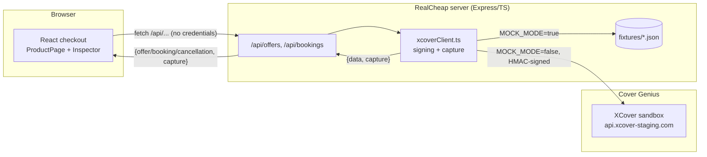
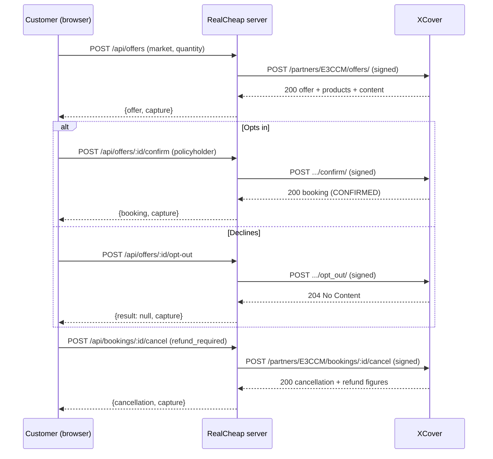
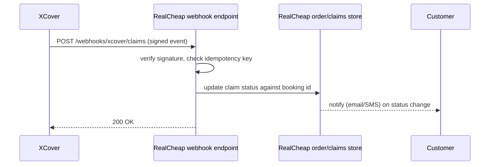

# Architecture

## Governing principle: fail open

> **RealCheap's checkout must complete even when XCover is entirely unavailable.** Protection is
> ancillary. A partner's revenue must never depend on our uptime.

This is not a hypothetical. Before the Phase 1 hardening pass (`docs/DECISIONS.md`, 2026-08-15),
a single network failure calling XCover — DNS failure, connection refused, or a slow response —
crashed the entire Node process, taking the whole checkout down with it, not just the protection
offer. Confirmed by deliberately breaking it: an unresolvable host produced an uncaught
`TypeError: fetch failed` that killed the server. Every place XCover is called now degrades
instead: `xcoverClient.ts` never throws for a reachability failure (network error, timeout, or a
non-JSON body), the frontend shows the customer a working "continue without protection" path when
Create Offer fails for any reason, and a defense-in-depth error boundary/handler exists at both
the Express and React layers in case something else goes wrong. See "Failure handling" below.

## What's built

The API key and secret live only in `server/.env` (repo root `.env`, read via `config.ts`) and
are used only inside `xcoverClient.ts`. The browser never sees them — every header the frontend
displays in the Inspector has already been redacted server-side before it leaves the process
(see `redactHeaders` in `server/src/xcoverClient.ts`).

## Request flow

## Failure handling

Three distinct failure classes, handled differently, because they mean different things:

1. **XCover responds with an error** (4xx/5xx). A normal `capture.status` >= 400 with a real
   body — not a crash, not a special case. The Inspector shows it like any other call.
2. **XCover is unreachable** (DNS failure, connection refused, or our own 10s timeout —
   `docs/API-NOTES.md` for why 10s). `xcoverClient.ts`'s `request()` catches this and returns
   `capture.status: 0`, `capture.networkError: <reason>` instead of throwing. The proxy's own
   HTTP response is still a clean `200` with that capture envelope inside it — the frontend and
   Inspector branch on `networkError` to show "XCover was unreachable" distinctly from "XCover
   said no."
3. **Something we didn't anticipate** (a bug, not a known failure mode). `asyncHandler` wraps
   every Express route so a rejected promise reaches `next(err)` instead of crashing the process;
   a terminal error-handling middleware in `index.ts` turns that into a `500` JSON response; a
   `process.on("unhandledRejection", ...)` handler is the last-resort net beneath that. On the
   frontend, `ErrorBoundary` (`web/src/components/ErrorBoundary.tsx`) catches a render-time crash
   in the checkout UI itself so it degrades to a message instead of a blank page.

**The fail-open path that matters most**: when Create Offer fails for *any* reason (case 1, 2, or
a thrown exception reaching `fetchOffer`'s `catch`), the frontend shows the error and a "Continue
checkout without protection" button (`App.tsx`, `decision: "unprotected"`) — the purchase is not
blocked by XCover being down or erroring. `handleOptIn`/`handleDecline`/`handleCancel` each got
the same treatment: previously a failed call did nothing visible at all (no state change, no
message); now each surfaces a specific, actionable error.

This was verified by actually breaking it, not just reading the code — deliberately pointed
`XCOVER_API_DOMAIN` at an unresolvable host, a non-routable address (timeout), a host returning
HTML instead of JSON, and a host returning a real `500`. All four degraded to a normal `200`
proxy response with the failure captured, and the server process stayed up throughout — confirmed
via `/api/health` staying reachable after each. See `docs/DECISIONS.md`, 2026-08-15 entry, for
the exact commands.

## Out of scope

The following were deliberately not built, per CLAUDE.md's scope boundary. They're described
here to the level a panel would need to evaluate the design without shipped code.

### Real-time SKU/category eligibility rules engine

**What it would do**: not every product RealCheap sells is eligible for every protection
product — e.g. perishables, digital goods, or already-insured categories might need to be
excluded before an offer is even requested, and eligibility can vary by market.

**Why out of scope**: this prototype has exactly one hardcoded product (the laptop). Building a
real rules engine needs a real product catalog with categories/SKUs to rule on, which doesn't
exist here — there'd be nothing to demo it against beyond a trivial if/else that wouldn't
reflect how a real rules engine behaves.

**Where it would plug in**: as a check on RealCheap's side, before `POST /api/offers` is even
called — the checkout would simply not render the protection section for an ineligible line
item. It would *not* live inside `xcoverClient.ts`, since eligibility is a RealCheap merchandising
concern, not something XCover's API surface exposes generically (the sandbox already implicitly
handles offer-schema-level eligibility via `offer_config_id`/`offer_schema` — a category/SKU
engine would be a layer above that, filtering which line items ask for an offer at all).

### Webhook receiver for claim status

**Design**: a dedicated endpoint (not built) that Cover Genius would call on claim lifecycle
events (submitted, approved, paid, denied). It would need: signature verification symmetric to
the outbound HMAC scheme (or whatever XClaim's webhook auth turns out to be — unconfirmed,
would need to ask Cover Genius, same as the two items in `docs/OPEN-QUESTIONS.md`), an
idempotency check (webhooks can be redelivered), and a mapping from XCover's booking/quote ID
back to RealCheap's own order ID to know which customer to notify.

**Why out of scope**: requires a persistent order/claims store and a real notification channel,
both explicitly excluded by CLAUDE.md ("Authentication, persistence, or anything resembling a
real order management system").

### Settlement and reconciliation

**What it would do**: periodically reconcile XCover's reported commission and premium totals
(visible per-quote in the Confirm Offer / Cancel Booking responses this prototype already
captures — `commission.partner_commission`, `total_premium`) against RealCheap's own ledger, to
catch drift (a cancelled-but-not-refunded policy, a commission that never landed, etc.).

**Why out of scope**: needs a real ledger and a real settlement/payout cadence with Cover
Genius, neither of which is meaningful to fake for a demo — a mock reconciliation job reconciling
against itself proves nothing.

**Where it would plug in**: a scheduled job reading `partner.transaction_id` (already a field on
Create Offer's `partner` object, unused by this prototype) as the join key between RealCheap's
order records and XCover's booking records, diffing totals, and flagging mismatches for manual
review.

### Authentication, persistence, real order management

This prototype has no login, no database, and no order history — checkout state lives entirely
in React state and disappears on page refresh. A real integration would sit inside RealCheap's
actual order pipeline: the protection decision (opt-in/decline) and the resulting booking ID
would be stored against the real order record, not just displayed once in the Inspector.
Building that here would mean building a generic e-commerce backend, which is explicitly out of
scope — the thing being demonstrated is the XCover integration itself, not an order management
system that happens to call XCover.
