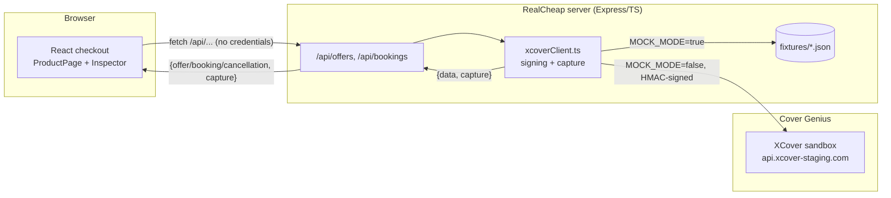
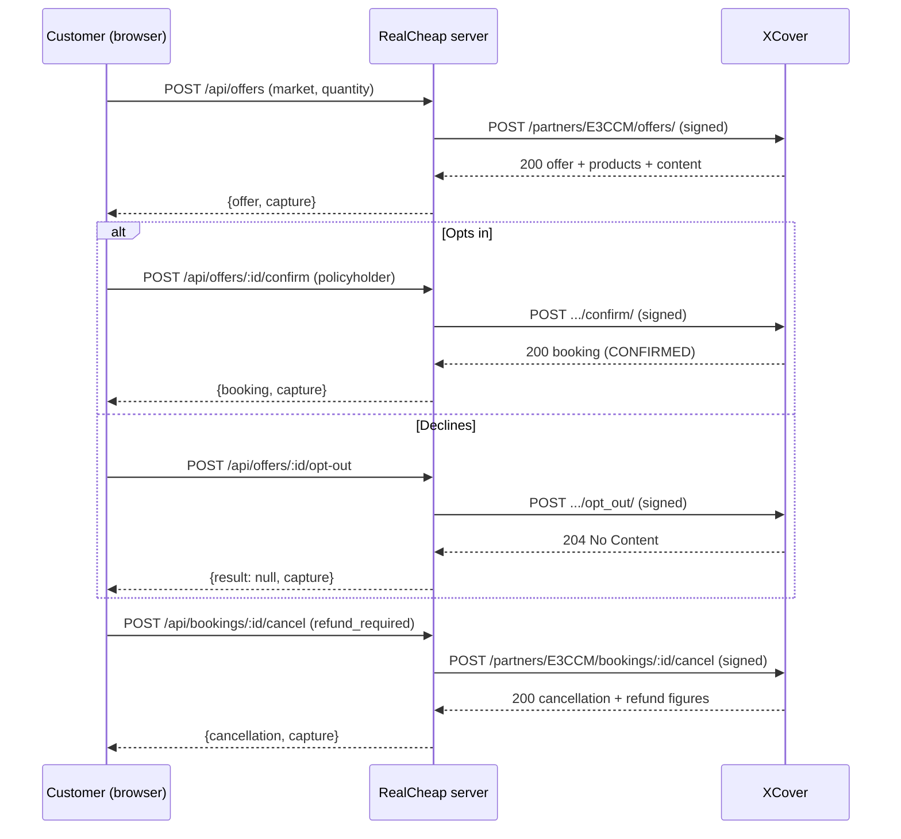
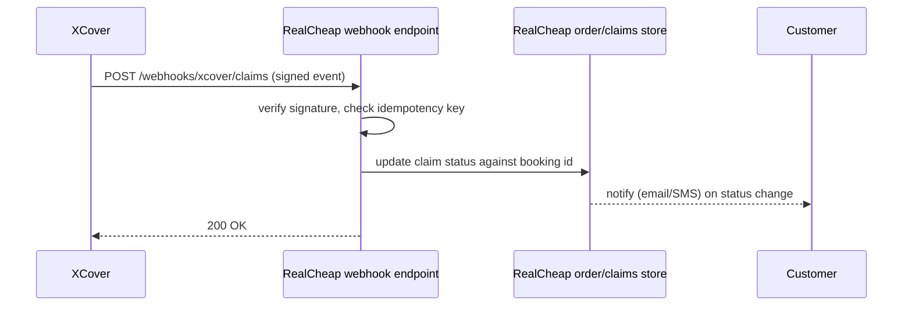

# Architecture

## What's built

The API key and secret live only in `server/.env` (repo root `.env`, read via `config.ts`) and
are used only inside `xcoverClient.ts`. The browser never sees them — every header the frontend
displays in the Inspector has already been redacted server-side before it leaves the process
(see `redactHeaders` in `server/src/xcoverClient.ts`).

## Request flow

## Out of scope

The following were deliberately not built, per CLAUDE.md's scope boundary. They're described
here to the level a panel would need to evaluate the design without shipped code.

### Real-time SKU/category eligibility rules engine

**What it would do**: not every product RealCheap sells is eligible for every protection
product — e.g. perishables, digital goods, or already-insured categories might need to be
excluded before an offer is even requested, and eligibility can vary by market.

**Why out of scope**: this prototype has exactly one hardcoded product (the laptop). Building a
real rules engine needs a real product catalog with categories/SKUs to rule on, which doesn't
exist here — there'd be nothing to demo it against beyond a trivial if/else that wouldn't
reflect how a real rules engine behaves.

**Where it would plug in**: as a check on RealCheap's side, before `POST /api/offers` is even
called — the checkout would simply not render the protection section for an ineligible line
item. It would *not* live inside `xcoverClient.ts`, since eligibility is a RealCheap merchandising
concern, not something XCover's API surface exposes generically (the sandbox already implicitly
handles offer-schema-level eligibility via `offer_config_id`/`offer_schema` — a category/SKU
engine would be a layer above that, filtering which line items ask for an offer at all).

### Webhook receiver for claim status

**Design**: a dedicated endpoint (not built) that Cover Genius would call on claim lifecycle
events (submitted, approved, paid, denied). It would need: signature verification symmetric to
the outbound HMAC scheme (or whatever XClaim's webhook auth turns out to be — unconfirmed,
would need to ask Cover Genius, same as the two items in `docs/OPEN-QUESTIONS.md`), an
idempotency check (webhooks can be redelivered), and a mapping from XCover's booking/quote ID
back to RealCheap's own order ID to know which customer to notify.

**Why out of scope**: requires a persistent order/claims store and a real notification channel,
both explicitly excluded by CLAUDE.md ("Authentication, persistence, or anything resembling a
real order management system").

### Settlement and reconciliation

**What it would do**: periodically reconcile XCover's reported commission and premium totals
(visible per-quote in the Confirm Offer / Cancel Booking responses this prototype already
captures — `commission.partner_commission`, `total_premium`) against RealCheap's own ledger, to
catch drift (a cancelled-but-not-refunded policy, a commission that never landed, etc.).

**Why out of scope**: needs a real ledger and a real settlement/payout cadence with Cover
Genius, neither of which is meaningful to fake for a demo — a mock reconciliation job reconciling
against itself proves nothing.

**Where it would plug in**: a scheduled job reading `partner.transaction_id` (already a field on
Create Offer's `partner` object, unused by this prototype) as the join key between RealCheap's
order records and XCover's booking records, diffing totals, and flagging mismatches for manual
review.

### Authentication, persistence, real order management

This prototype has no login, no database, and no order history — checkout state lives entirely
in React state and disappears on page refresh. A real integration would sit inside RealCheap's
actual order pipeline: the protection decision (opt-in/decline) and the resulting booking ID
would be stored against the real order record, not just displayed once in the Inspector.
Building that here would mean building a generic e-commerce backend, which is explicitly out of
scope — the thing being demonstrated is the XCover integration itself, not an order management
system that happens to call XCover.
